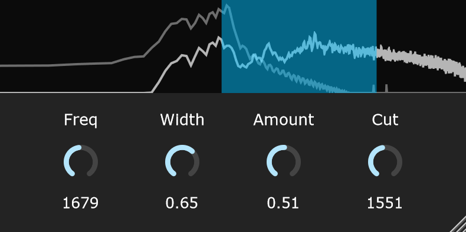

# Erode
An audio effect inspired by Ableton's Erosion.

## Demo
[Erode demo](https://www.youtube.com/watch?v=I-n5yw1lSFw)

## Features

- Real-time spectrum display (the dimmer one represents the dry signal and the brighter one represents the wet signal)
- Drag the band in the display to set frequency (X) and width (Y)
- Morph between noise and sine modulation through width
- High-pass filter for output cleanup
- Clean, resizable UI

## Controls

- **Freq:** Center frequency of the modulator/filter (20 Hz - 20 kHz)
- **Width:** Bandwidth of the filter (0 = narrow/sine, 1 = wide/noise)
- **Amount:** Modulation depth and wet/dry mix
- **Cut:** Output high-pass filter cutoff (20 Hz - 20 kHz)
- **Spectrum Display:**  
  - Drag band horizontally to change frequency  
  - Drag band vertically to change width

## Build Instructions

- Currently only available for Windows
- Requires [JUCE](https://juce.com/) (version 8.0.12+)
- Open `Erode.sln` in Visual Studio
- Build the project and copy the plugin to your plugin folder

## Usage Tips

- Double-click knobs to enter precise values
- Use the spectrum to visually tune the effect
